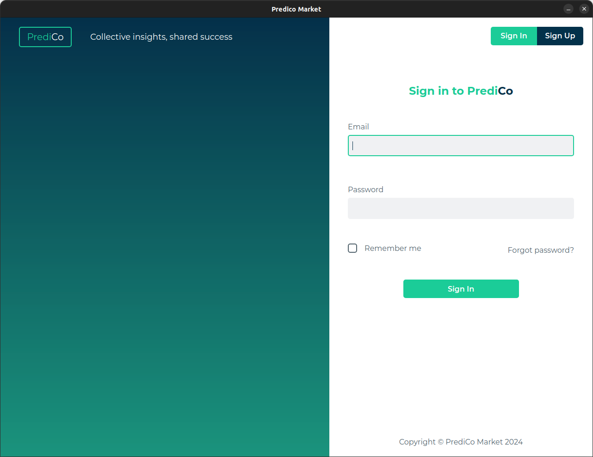
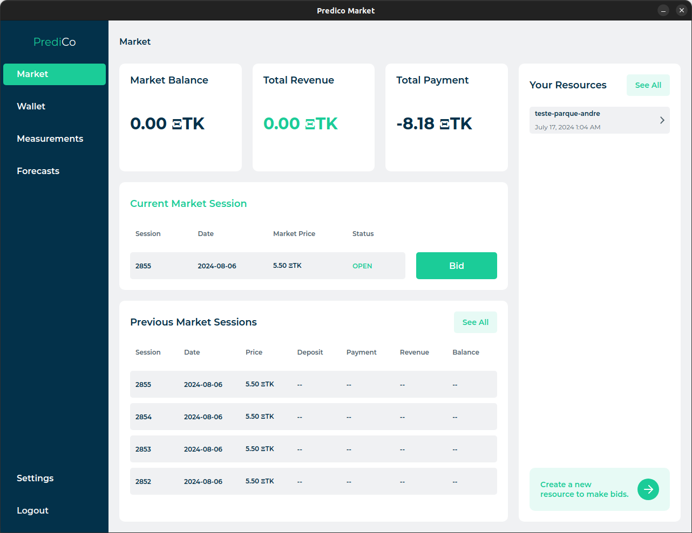

# PREDICO  (Data Sharing / Barter Incentives) client.

A Dockerized interface for the https://github.com/CPES-Power-and-Energy-Systems/data-sharing-barter-incentives-rest-api 
Datamarket Server API.

The objective of this API software package is to provide an in-between assistance in the communication between the Datamarket client and the Datamarket Server API. 
Its goal is mainly to abstract the client from the complexity of the underlying Blockchain and IDS Dataspace technologies required 
to interact with the platform.

The client wallet will still be located in the client's machine, but the client will not need to interact with it directly.

> [!CAUTION]
> This package should be used exclusively for testing use cases purposes in testnet environments ONLY.

# Installation

You need first to get access to the PREDICO (Data Sharing / Barter Incentives) client repository and clone it to your local machine.
    
```shell
git clone https://github.com/CPES-Power-and-Energy-Systems/predico-data-sharing-barter-client.git
```

## Environment variables


Create a `.env` file in the root directory of the project with the following content:

```shell
GITLAB_TOKEN=
BASE_URL=http://localhost:8000
PREDICO_BASE_URL=http://predico01.inesctec.pt
USE_DATASPACE=False
REFRESH_TOKEN_EXPIRE_DAYS=7
PAYMENT_PROCESSOR_TYPE=ERC20 # ERC20,IOTA,FIAT

# Database Settings
POSTGRES_NAME=predico
POSTGRES_USER=predico
POSTGRES_PASSWORD=predico
POSTGRES_HOST=predico-client_postgresql

# Client Connector (My own Connector)
MY_CONNECTOR_ACCESS_URL=https://connector-02.enershare.inesctec.pt
MY_CONNECTOR_ID=urn:ids:enershare:connectors:connector-02
MY_CONNECTOR_AGENT_ID=urn:ids:enershare:participants:VascoGuedes
MY_CONNECTOR_API_KEY=
API_VERSION=1.0.0

# Metadata Broker
METADATA_BROKER=https://broker.enershare.dataspac.es/

# External Connector
EXTERNAL_ACCESS_URL_1=https://connector-01.enershare.inesctec.pt/router
EXTERNAL_CONNECTOR_ID_1=urn:ids:enershare:connectors:connector-01

EXTERNAL_ACCESS_URL=https://connector-01.enershare.inesctec.pt/router
EXTERNAL_CONNECTOR_ID=urn:ids:enershare:connectors:connector-01:Agent
EXTERNAL_AGENT_ID=urn:ids:enershare:participants:VascoGuedes

# Ethereum credentials
ETH_PUBLIC_KEY=
ETH_PRIVATE_KEY=

# Ethereum Payment Gateway
CONTRACT_ADDRESS=0xb6bf9f117f76bbbf20a5ff942ba8bd48c3acee89
WEB3_PROVIDER_URL=https://sepolia.infura.io/v3/cf175d91d8c7403fa135f523098f85f5
ETHERSCAN_API_KEY=
```

## Build docker image

Build docker image:

```shell
$ docker-compose build
```

## Run docker container

Run docker container image. This will start the python client API simulation tool:

```shell
$ docker-compose up
```

## Documentation

The documentation for the Predico Datamarket API can be found at: http://localhost:8000/swagger

## UI

### Barter Desktop App 

|                |                                       |
|:---------------------------------------------------------:|:-----------------------------------------------------------------------------------------:|
| **Login**<br>Entrypoint to the Barter Client Application. | **Dashboard**<br>Overview of account activities, market sessions, and available resources |


#### Download application
Can download through the releases page on the repository or alternatively through the following links (latest):

- Windows: https://tinyurl.com/zazpbakt

[//]: # (- MacOS: )
- Linux: https://tinyurl.com/mrvsjhde

[//]: # (The UI for the Predico Datamarket API can be found at: http://localhost:8000)
[//]: # (https://github.com/jyotiv2023/admindash?ref=reactjsexample.com)

# Steps

The following steps are required to run the simulation tool and interact with the Predico Datamarket API.
It's advised to run the steps in the order they are presented.

You may use POSTMAN in order to interact with the API. The Postman collection can be found at: 
https://documenter.getpostman.com/view/391645/2s9YJZ5Qc7

1. Step 1: <strong>[USER]</strong> - Register a new user
2. Step 2: Validate email address
3. Step 3: <strong>[USER]</strong> - Login
4. Step 4: <strong>[WALLET]</strong> - Fund wallet
5. Step 5: <strong>[WALLET]</strong> - Register Wallet address in the market
6. Step 6: <strong>[RESOURCE]</strong> - Create a new resource
7. Step 7: <strong>[MARKET]</strong> - Get list of sessions
8. Step 8: <strong>[MARKET]</strong> - Bid in an open session
9. Step 9: <strong>[MARKET]</strong> - Get market bid
